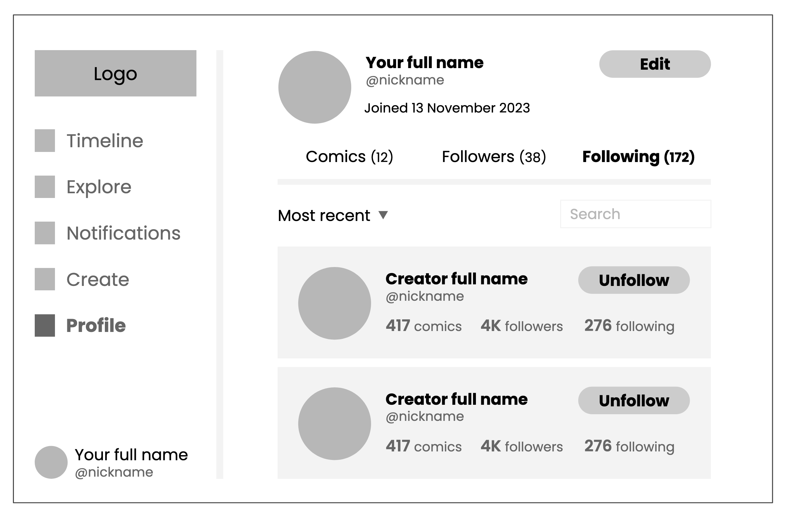

# Masking Technology Design System (MTDS)

A simple, customizable design system that wraps common CSS features into elements and turns standard HTML elements into interactive components. Currently, only React is supported.



## Installation

```bash
npm install @maskingtech/designsystem
```

## Usage

To activate it, its root element needs to be added to the application.

```tsx
import { DesignSystem } from '@maskingtech/designsystem';

import '@maskingtech/designsystem/style.css';

<DesignSystem>
    {/* elements and components here */}
</DesignSystem>
```

The list of elements, components, and customization options can be found in the [documentation](docs/README.md).
